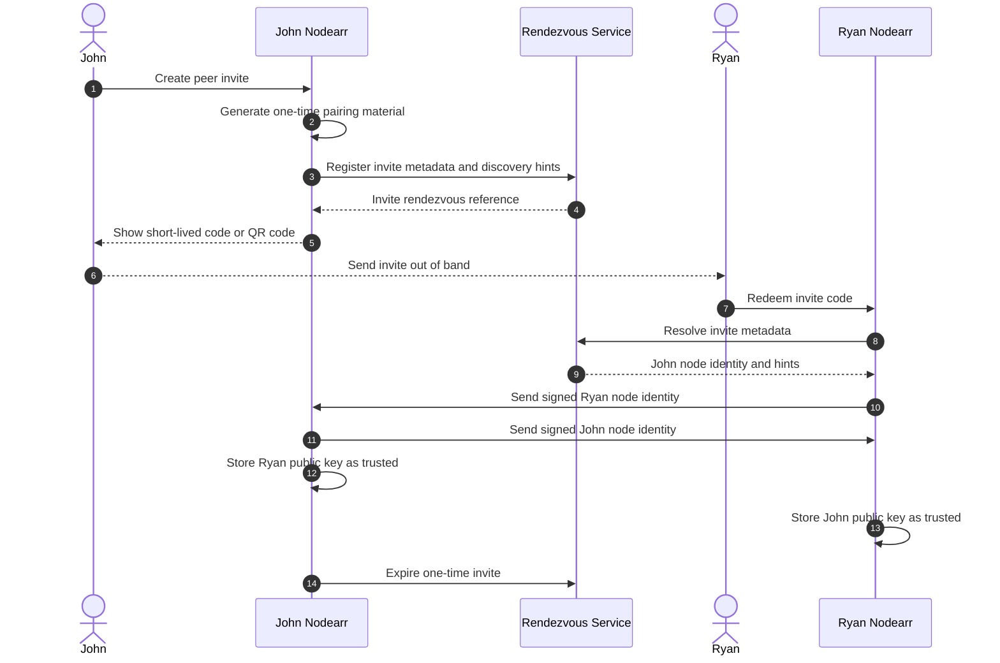

# Peer invite and trust establishment

A short-lived invite authorizes pairing. Long-lived node keypairs establish ongoing peer identity after the invite is redeemed.

```mermaid
sequenceDiagram
    autonumber
    actor Owner as John
    participant NodeA as John Nodearr
    participant Rendezvous as Rendezvous Service
    actor Peer as Ryan
    participant NodeB as Ryan Nodearr

    Owner->>NodeA: Create peer invite
    NodeA->>NodeA: Generate one-time pairing material
    NodeA->>Rendezvous: Register invite metadata and discovery hints
    Rendezvous-->>NodeA: Invite rendezvous reference
    NodeA-->>Owner: Show short-lived code or QR code
    Owner-->>Peer: Send invite out of band
    Peer->>NodeB: Redeem invite code
    NodeB->>Rendezvous: Resolve invite metadata
    Rendezvous-->>NodeB: John node identity and hints
    NodeB->>NodeA: Send signed Ryan node identity
    NodeA->>NodeB: Send signed John node identity
    NodeA->>NodeA: Store Ryan public key as trusted
    NodeB->>NodeB: Store John public key as trusted
    NodeA->>Rendezvous: Expire one-time invite
```
